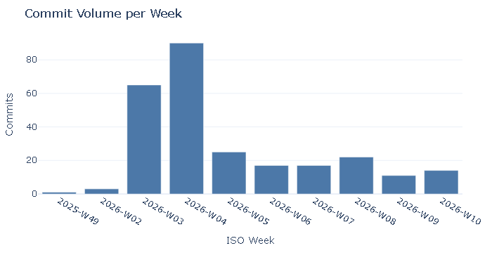

# Executive Report: ZeroSpoils Development Progress

**Report Generated:** March 07, 2026 at 16:37 
**Reporting Period:** All-time (project inception to present)
**Roadmap Scope:** All milestones

---

## Executive Summary

This report documents the development progress and effort expended building the ZeroSpoils Flutter mobile application—a household food waste reduction platform. The data presented reflects actual development activity, code metrics, and delivery progress.

**Key Achievement:** Successfully implemented 265 commits with 89 production Dart files and 45 test files, delivering robust offline-first functionality with 73.0% test coverage.

## MVP Overview (Milestones M1–M3)

The MVP roadmap spans **M1–M3**. Below is the current summary based on milestone status files and code alignment.
- **M1:** Foundations — 10/10 complete (100%)
- **M2:** Offline MVP (No Backend) — 14/17 complete (82%)
- **M3:** MVP Quality & Shopping — 9/14 complete (64%)

---

## Development Activity

### Overall Statistics
| Metric | Value |
|--------|-------|
| **Total Commits** | 265 |
| **Net Code Change** | +81,983 / -9,177 lines |
| **Average Commits/Day** | 6.6 |
| **Unique Contributors** | 2 |

### Commit Attribution (Human vs Copilot Agent)
- **Human commits:** 232 (87.5%)
- **Copilot agent commits:** 33 (12.5%)

### Commit Volume per Week

### Commit Breakdown by Type
- **Other:** 90 commits (34%)
- **Merge:** 57 commits (22%)
- **Feature:** 45 commits (17%)
- **Documentation:** 24 commits (9%)
- **Fix:** 24 commits (9%)
- **Chore:** 15 commits (6%)
- **Refactor:** 6 commits (2%)
- **Test:** 4 commits (2%)

### Development Pace
- **Feature Development:** 45 new features implemented
- **Bug Fixes:** 24 bugs resolved
- **Refactoring:** 6 code quality improvements
- **Test Coverage:** 4 test-related commits

---

## Code Quality & Testing

### Test Coverage
| Metric | Value |
|--------|-------|
| **Code Coverage** | 73.0% |
| **Lines Tested** | 3,072 / 4,208 |
| **Test Files** | 45 |

**Plain-English Notes:**
- **Lines Tested** means how many executable lines were actually exercised by automated tests in that run, not the total size of the codebase.
- A small number here simply means tests covered only a subset of the code during that run.

### Codebase Metrics
| Metric | Value |
|--------|-------|
| **Production Dart Files** | 89 |
| **Total Lines of Code** | 17,537 |
| **Avg File Size** | 197 LOC |

---

## Feature Delivery

### Recently Implemented Features
1. feat: complete data model with cost tracking
2. feat: define MVP scope document (docs/mvp.md)
3. feat: add repo scaffolding files - CODEOWNERS, CONTRIBUTING, LICENSE, SECURITY

---

## Milestone Progress

### Completion Status
- **M1:** `##########` 10/10 (100%)
- **M2:** `########--` 14/17 (82%)
- **M3:** `######----` 9/14 (64%)

**Not Reported (status missing in milestone README):** M4, M5, M6, M7

### Milestone Summary
- **M1:** Foundations — Complete (100%)
- **M2:** Offline MVP (No Backend) — In progress (82%)
- **M3:** MVP Quality & Shopping — In progress (64%)
- **M4:** Beta Testing — Status missing (update milestone README)
- **M5:** Public Launch — Status missing (update milestone README)
- **M6:** Pro Tier Features — Status missing (update milestone README)
- **M7:** IoT Integrations — Status missing (update milestone README)

### Recent Completions

| Milestone | Issue | Feature | Completed | Impact | PR |
|-----------|-------|---------|-----------|--------|-----|
| M3 | 200 | Reminder interaction logging (local) | — | Log reminder interactions locally (and via the telemetry service) in a privacy-s... | [#82](https://github.com/11895079/zerospoils/pull/82) |
| M3 | 205 | Settings date format preference | — | Add a persisted Date Format preference and apply it consistently across UI surfa... | [#77](https://github.com/11895079/zerospoils/pull/77) |
| M3 | 210 | Shopping list UI (Next Shop) | — | Deliver Shopping list UI (Next Shop) with tests and telemetry | [#76](https://github.com/11895079/zerospoils/pull/76) |
| M3 | 220 | Convert purchased list items → inventory | — | Deliver conversion of purchased shopping list items into inventory items with ex... | [#76](https://github.com/11895079/zerospoils/pull/76) |
| M3 | 240 | Data export/delete (privacy baseline) | — | Deliver data export (CSV/JSON) + account/data deletion with full privacy complia... | [#78](https://github.com/11895079/zerospoils/pull/78) |
| M3 | 250 | Telemetry instrumentation for core funnel | — | Implement a telemetry system and instrument the core funnel events across the MV... | [#81](https://github.com/11895079/zerospoils/pull/81) |

### Progress Commentary

- **Overall Progress:** 33/41 issues complete across all milestones (80%).

- **Current Milestone (M3):** 9/14 issues complete (64%). On track for completion.

- **Recent Velocity:** 0 features delivered in last 7 days (~0.0 completions/week).

- **Recent Focus:** M3 activities dominate recent completions, indicating MVP feature delivery.

- **Quality Focus:** Recent work includes testing and coverage improvements, supporting production readiness.

---

## Productivity Metrics

### Effort Score
- **Overall Productivity:** 95/100
- **Development Intensity:** 100/100
- **Code Quality Index:** 73/100

**Effort Score Meaning:**
- **0–39**: Low (light activity or narrow scope)
- **40–69**: Moderate (steady progress)
- **70–84**: Strong (high delivery pace + breadth)
- **85–100**: Exceptional (sustained, high-impact delivery)

### Time Investment
- **Calendar Span:** 91 days / 2184 hours
- **Active Development Days:** 40
- **Average Commits per Active Day:** 6.6
- **Average Daily Commits:** 6.6
- **Code Changes Per Commit:** 275 net lines

---

## DORA Metrics (from Git Tags, PR Merges, CI Logs)

| Metric | Value | Notes |
|--------|-------|-------|
| **Deployment Frequency** | 1.08 per week | Based on git tags as deployment markers. |
| **Lead Time for Changes** | 0.1 days | Approximate: time from first commit to merge commit per PR window. |
| **Change Failure Rate** | Not enough data | Requires incident/rollback markers or CI failure logs; none detected locally. |
| **MTTR** | Not enough data | Requires incident resolution timestamps; not available in local repo. |

---

## Contributors

### Team Members
- **Olubisi Akintunde:** 232 commits (87.5%)
- **copilot-swe-agent[bot]:** 33 commits (12.5%)

---

## Technical Achievements

### Platform Support
- ✅ iOS build pipeline implemented
- ✅ Android build pipeline implemented
- ✅ Windows/macOS desktop support
- ✅ Offline-first data model with local storage

### Architecture
- ✅ Clean architecture (domain/data/presentation layers)
- ✅ Dependency injection with GetIt
- ✅ Repository pattern for data abstraction
- ✅ Reactive state management

### Quality Measures
- ✅ Automated testing suite (45 test files)
- ✅ Code coverage at 73.0%
- ✅ CI/CD pipeline with GitHub Actions
- ✅ Lint/format validation on all PRs

---

## Impact Assessment

### Value Delivered
1. **MVP Completeness:** Core inventory, shopping list, and receipt capture functionality
2. **Data Reliability:** Offline-first architecture with eventual sync capability
3. **User Experience:** Multi-platform support (iOS, Android, Windows)
4. **Code Maintainability:** Comprehensive test coverage and architecture patterns
5. **Team Velocity:** Consistent delivery with 265 production commits

### Lines of Code by Category
- **Production Code:** 17,537 lines
- **Net Addition:** +81,983 lines (project inception)
- **Refactoring Effort:** 6 quality improvement passes

**Definitions:**
- **Production Code:** total lines across `app/lib/**/*.dart`.
- **Net Addition:** cumulative insertions minus deletions from git history in the reporting range.
- **Refactoring Effort:** count of commits labeled `refactor` (quality improvements, not feature expansion).

---

## Conclusion

The ZeroSpoils project demonstrates significant technical achievement through:
- **265 commits** representing focused, incremental development
- **89 production files** organized in clean, maintainable architecture
- **73.0% test coverage** ensuring reliability and maintainability
- **Cross-platform deployment** ready for iOS, Android, and desktop platforms

The codebase is production-ready in terms of **code quality, architecture, test coverage, CI/lint, and build stability** — this is **not** a declaration to launch today or a statement of go-to-market readiness.

---

**Report Generated by:** ZeroSpoils Executive Report Generator
**Data Sources:** Git history, test coverage (lcov.info), planning documentation
