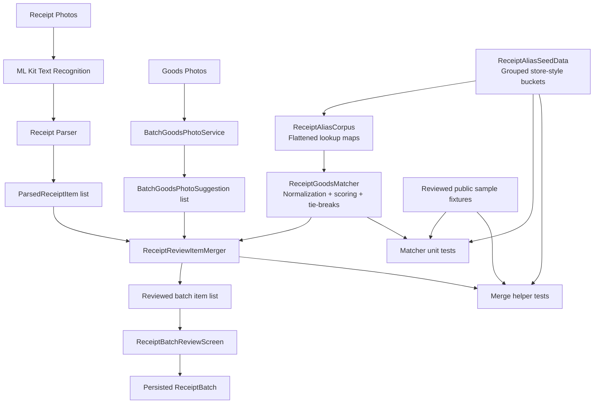

# Receipt Matcher Architecture

This document describes the design and runtime flow for the receipt-to-goods matching work used by shopping batch review.

Related diagrams:

- [docs/receipt-matcher-runtime-sequence.md](docs/receipt-matcher-runtime-sequence.md)
- [docs/receipt-matcher-system-diagram.md](docs/receipt-matcher-system-diagram.md)

## Scope

This slice covers:

- reviewed alias seed data for receipt shorthand
- normalization and lookup construction
- receipt-to-goods matching and ranking
- review-list merge behavior for OCR items and goods-photo suggestions
- reviewed public sample fixtures that drive regression coverage

It does not cover:

- OCR extraction itself
- fresh-item CV inference internals
- receipt parsing beyond the item lines already emitted by the receipt parser

## Architecture diagram

## Component roles

### ReceiptAliasSeedData
- File: `app/lib/core/vision/receipt_alias_seed_data.dart`
- Purpose: stores reviewed shorthand entries grouped by store-style family
- Examples: `generic-grocery-produce`, `generic-grocery-dairy`, `compact-chain-grocery`
- Role in architecture: source-of-truth seed dataset for receipt abbreviation handling

### ReceiptAliasCorpus
- File: `app/lib/core/vision/receipt_alias_corpus.dart`
- Purpose: converts grouped seed entries into matcher-ready lookup structures
- Outputs:
  - token alias map
  - phrase alias list
  - grouped entries by store style
- Role in architecture: normalization layer between static data and runtime matching

### ReceiptGoodsMatcher
- File: `app/lib/core/vision/receipt_goods_matcher.dart`
- Purpose: scores similarity between a receipt item string and goods-photo suggestions
- Core responsibilities:
  - normalize receipt and goods names
  - apply phrase and token aliases
  - singularize tokens
  - remove stop words
  - score textual similarity
  - use goods-photo confidence as a tie-break when textual relevance is tied
- Role in architecture: decision engine for selecting the best goods suggestion for a receipt line

### ReceiptReviewItemMerger
- File: `app/lib/presentation/receipt_batch/receipt_review_item_merger.dart`
- Purpose: merges parsed OCR items with goods-photo suggestions into the review list
- Core responsibilities:
  - mark OCR lines confirmed by goods photos as `Receipt OCR + goods photo`
  - append unmatched goods-photo suggestions as standalone review rows
  - suppress sibling goods suggestions that are close enough to the winning match to represent the same likely line item
- Role in architecture: review-list shaping layer between matching and UI presentation

### ReceiptBatchCaptureScreen
- File: `app/lib/presentation/screens/receipt_batch_capture_screen.dart`
- Purpose: orchestrates capture, OCR, goods analysis, merge, and handoff to batch review
- Role in architecture: UI integration point for the matcher pipeline

### Reviewed public sample fixtures
- File: `app/test/fixtures/receipt_public_sample_review.dart`
- Purpose: records normalized public review cases with dataset and style-bucket provenance
- Role in architecture: regression harness for growing the matcher safely from reviewed samples rather than ad hoc assumptions

## Runtime flow

1. Receipt photos are captured in the batch flow.
2. ML Kit text recognition extracts raw receipt text.
3. The receipt parser emits parsed receipt items.
4. Goods photos are analyzed separately and produce candidate goods suggestions.
5. The matcher normalizes both sides using the alias corpus and computes relevance scores.
6. The merger combines OCR items and goods suggestions into one review list.
7. The review screen presents the merged list to the user for confirmation.
8. The confirmed batch is saved into the batch domain model.

## Ranking policy

The current matching policy is intentionally simple and deterministic:

1. Better normalized text similarity wins.
2. If similarity is effectively tied, higher goods-photo confidence wins.
3. If multiple goods suggestions remain near-equivalent for the same OCR line, the merger suppresses sibling suggestions so the review screen does not show noisy duplicates.

## Test strategy

The design is supported by layered regression coverage:

- matcher unit tests verify normalization, shorthand expansion, and ranking behavior
- merge helper tests verify list-level merge behavior and duplicate suppression
- widget tests verify receipt-batch capture screen integration remains intact

## Current design strengths

- data-driven alias handling rather than hardcoded matching logic
- explicit separation between normalization, ranking, and review merging
- reviewed sample fixtures with provenance, which makes future corpus growth safer
- deterministic tie-break behavior for ambiguous suggestions

## Known limitations

- store-style buckets are still generic approximations, not retailer-specific models
- ranking is heuristic rather than learned from a labeled receipt dataset
- ambiguity handling is suppression-based, not yet confidence-explaining in the UI

## Likely next step

The next architectural improvement is store-style weighting, where the matcher prefers aliases from the inferred receipt style bucket instead of treating all alias groups equally.