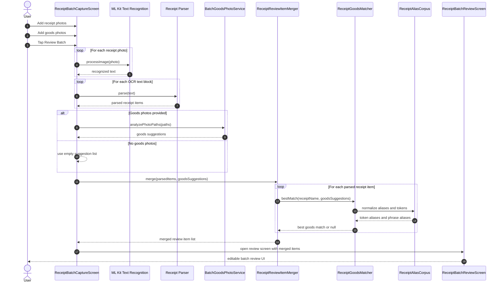

# Receipt Matcher Runtime Sequence

This document shows the runtime sequence for shopping-batch receipt processing from capture through review.

## Why this exists

The architecture diagram explains the component layout. This sequence diagram explains runtime order, ownership, and handoff between OCR, goods-photo analysis, matching, and review shaping.

## UML sequence diagram

## Notes

- `ReceiptBatchCaptureScreen` is the orchestration point.
- `ReceiptGoodsMatcher` decides best candidate per OCR line.
- `ReceiptReviewItemMerger` shapes the final review list and suppresses near-duplicate sibling goods suggestions.
- `ReceiptAliasCorpus` is used at runtime by the matcher, but its contents originate from the grouped seed data.