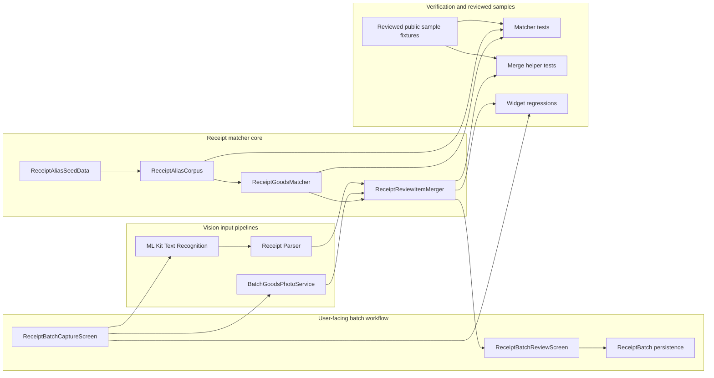

# Receipt Matcher System Diagram

This document shows the higher-level system placement of the receipt matcher work inside the shopping-batch feature.

## Why this exists

The runtime sequence diagram focuses on execution order. This system diagram focuses on boundaries, dependencies, and where this matcher slice sits relative to UI, vision services, domain flow, and tests.

## Higher-level system diagram

## Interpretation

- The capture screen gathers inputs and coordinates OCR and goods-photo analysis.
- The matcher core is isolated from UI and test fixtures, which keeps the ranking logic maintainable.
- The review screen receives already-merged items rather than raw OCR text and raw goods suggestions.
- Reviewed public sample fixtures form the safety net that lets the alias dataset and ranking rules evolve without silent regressions.

## Storage rationale

These system-level diagrams are stored in `docs/` next to the matcher architecture note because:

- this repo already keeps focused implementation design notes in `docs/`
- the diagrams are specific to one feature slice, not global app architecture only
- colocating them with `receipt-matcher-architecture.md` keeps discovery simple

If the codebase accumulates many feature-level architecture notes later, a future cleanup into `docs/architecture/` would make sense.