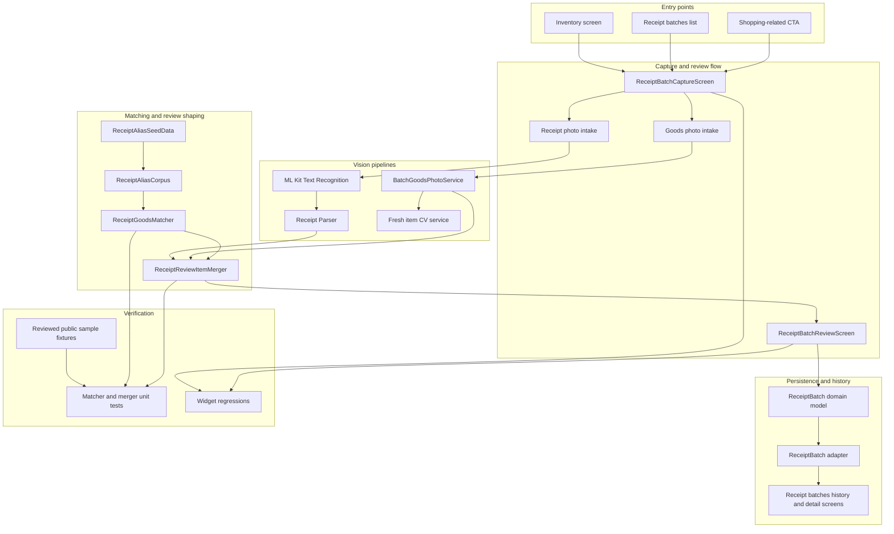

# Shopping Batch Architecture

This document places the receipt matcher work inside the broader shopping-batch feature.

## Scope

This architecture covers:

- batch capture entry and user flow
- receipt-photo OCR processing
- goods-photo suggestion pipeline
- receipt-to-goods matching and merge behavior
- review, confirmation, and persistence into receipt batches

This document does not cover unrelated inventory editing, recipe generation, or subscription/entitlement enforcement details.

## System diagram

## Architecture notes

### 1. Capture is intentionally split into two input lanes
- Receipt photos exist to extract structured shopping evidence from OCR.
- Goods photos exist to suggest likely purchased items and disambiguate short receipt lines.
- These lanes are related, but not the same problem, and the architecture keeps them separate until merge time.

### 2. Matching is a dedicated sub-layer, not UI glue
- `ReceiptAliasSeedData` stores reviewed shorthand and style-bucket data.
- `ReceiptAliasCorpus` exposes matcher-friendly lookups.
- `ReceiptGoodsMatcher` ranks candidate goods suggestions.
- `ReceiptReviewItemMerger` shapes the final review list shown to the user.

### 3. Review is the product control point
- The system does not auto-import raw OCR blindly.
- Users see the merged result in the review screen before batch persistence.
- This reduces risk from OCR noise and keeps the experience editable.

### 4. Persistence is batch-first
- The saved object is the receipt batch, not just isolated imported items.
- This preserves shopping context such as store, date, totals, receipt images, and goods-photo attachments.

## Related docs

- [docs/receipt-matcher-architecture.md](docs/receipt-matcher-architecture.md)
- [docs/receipt-matcher-runtime-sequence.md](docs/receipt-matcher-runtime-sequence.md)
- [docs/receipt-matcher-system-diagram.md](docs/receipt-matcher-system-diagram.md)
- [docs/receipt-matcher-sources.md](docs/receipt-matcher-sources.md)

## Current implementation status

Implemented:

- receipt-photo OCR path
- goods-photo suggestion path
- reviewed alias corpus and grouped seed data
- matcher scoring, tie-breaks, and sibling suppression
- review-list merge helper
- reviewed public fixture-driven regressions

Still heuristic / not final:

- store-style weighting is not implemented yet
- alias corpus breadth is still limited
- ambiguity explanation is not surfaced in the review UI
- retailer-specific modeling is not yet present