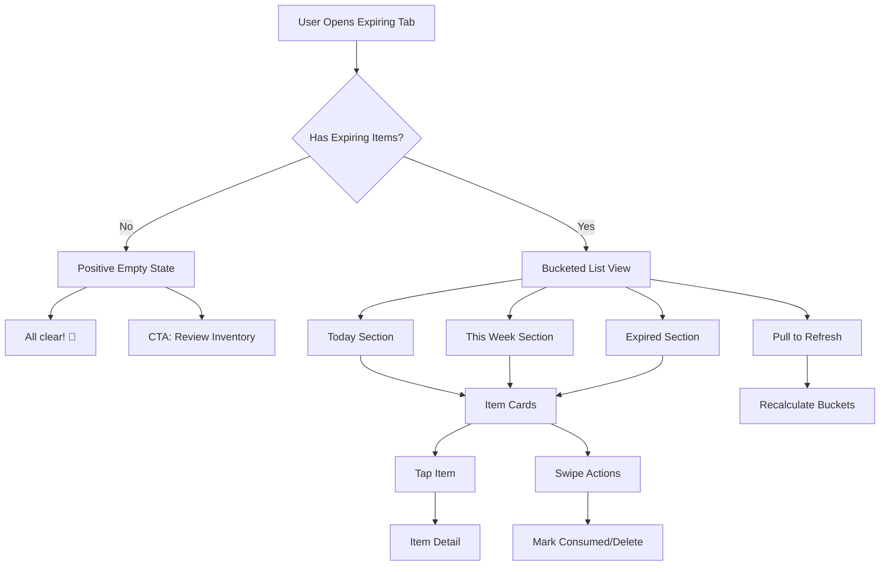

# Wireframe: Expiring Soon Screen

## Purpose
Core value proposition screen: bucketed view of items by expiry urgency. Encourages daily engagement and waste reduction action.

## Mermaid Diagram



## Screen Layout (Mobile Portrait)

```
┌─────────────────────────────────┐
│  Expiring Soon         [Sort]   │ ← Header
├─────────────────────────────────┤
│                                 │
│  TODAY (2)            ⚠️        │ ← Section header
│  ┌─────────────────────────────┤
│  │ 🍎 Apples                   │ │
│  │ Expires today               │ │
│  └─────────────────────────────┘│
│  ┌─────────────────────────────┤
│  │ 🥛 Milk                     │ │
│  │ Expires in 8 hours          │ │
│  └─────────────────────────────┘│
│                                 │
│  THIS WEEK (3)         ⏰       │ ← Section header
│  ┌─────────────────────────────┤
│  │ 🥕 Carrots                  │ │
│  │ Expires in 2 days           │ │
│  └─────────────────────────────┘│
│  ┌─────────────────────────────┤
│  │ 🍞 Bread                    │ │
│  │ Expires in 3 days           │ │
│  └─────────────────────────────┘│
│  ┌─────────────────────────────┤
│  │ 🧀 Cheese                   │ │
│  │ Expires in 5 days           │ │
│  └─────────────────────────────┘│
│                                 │
│  EXPIRED (1)           🔴       │ ← Section header
│  ┌─────────────────────────────┤
│  │ 🥬 Lettuce                  │ │
│  │ Expired 1 day ago           │ │
│  └─────────────────────────────┘│
│                                 │
└─────────────────────────────────┘
```

## Positive Empty State

```
┌─────────────────────────────────┐
│  Expiring Soon                  │
├─────────────────────────────────┤
│                                 │
│         ✨ 🎉 ✨               │
│                                 │
│   All clear!                    │
│                                 │
│   Nothing expiring soon.        │
│   Great job staying on top      │
│   of your inventory!            │
│                                 │
│  ┌─────────────────────────────┤
│  │   Review Inventory          │ │ ← Secondary button
│  └─────────────────────────────┘│
│                                 │
└─────────────────────────────────┘
```

## Figma Expansion Prompt

> **Prompt:** "Design a mobile app screen showing grocery items grouped into urgency buckets: TODAY (orange/red alert), THIS WEEK (yellow/orange), and EXPIRED (red danger). Use collapsible section headers with item counts and status icons (⚠️ warning, ⏰ clock, 🔴 danger). Each item card shows emoji/icon, name, and relative expiry time (e.g., 'Expires in 2 days', 'Expired 1 day ago'). Color-code cards: red gradient for today/expired, orange for this week, green for >5 days. Include a positive empty state with celebration emoji (🎉) and encouraging copy: 'All clear! Nothing expiring soon.' Add a 'Review Inventory' CTA button. Support pull-to-refresh to recalculate buckets. Use orange alert color (#f08c00) and red danger (#e03131). Non-judgmental, encouraging tone throughout. Follow iOS/Material Design guidelines. Touch targets 44pt minimum."

## Bucketing Logic

```javascript
// Pseudo-code for expiry bucketing
const now = Date.now();
const item.expiryDate;

if (item.expiryDate < now) {
  bucket = "EXPIRED";
} else if (item.expiryDate - now <= 24 * 60 * 60 * 1000) {
  bucket = "TODAY"; // 0-24 hours
} else if (item.expiryDate - now <= 7 * 24 * 60 * 60 * 1000) {
  bucket = "THIS WEEK"; // 1-7 days
} else {
  // Not shown on Expiring Soon screen
  bucket = "LATER";
}
```

## Interaction Details
- **Tab navigation:** Second tab in tab bar
- **Pull to refresh:** Recalculate buckets based on current time
- **Section collapse:** Tap header to collapse/expand bucket (persist state)
- **Card tap:** Navigate to Item Detail screen
- **Swipe actions:** Same as Inventory (swipe left = delete, right = consumed)
- **Sorting:** Within buckets, sort by expiry date ascending
- **Badge on tab:** Show count of "Today" items (e.g., "Expiring (2)")
- **Empty state CTA:** Navigate to Inventory tab

## Accessibility
- [ ] Announce bucket counts: "Today: 2 items, This Week: 3 items"
- [ ] Color not sole indicator (use icons + text: "Expires today ⚠️")
- [ ] Section headers use semantic heading roles
- [ ] Relative time announcements: "Apples, expires in 8 hours"
- [ ] Positive empty state copy is encouraging, not punitive
- [ ] Pull-to-refresh announces "Refreshing expiry information"

## Related Docs
- See `docs/design-tokens.md` for color palette
- See issue `110-expiry-logic-library.md` for bucketing rules
- See issue `160-mvp-expiring-soon-screen.md` for acceptance criteria

## Status
🚧 **PLACEHOLDER** - To be expanded in Figma during M1.
