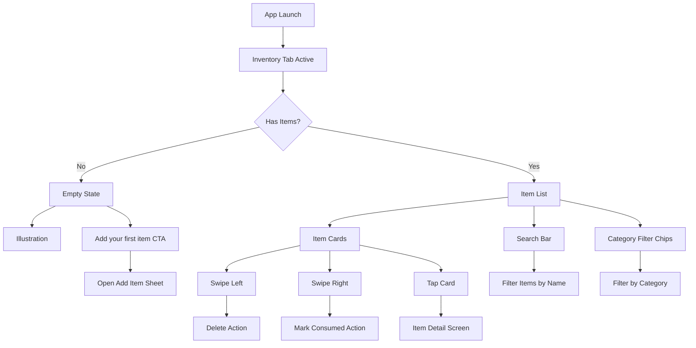

# Wireframe: Inventory List Screen

## Purpose
Primary screen showing all active inventory items. Supports search, category filtering, and quick actions via swipe gestures.

## Mermaid Diagram



## Screen Layout (Mobile Portrait)

```
┌─────────────────────────────────┐
│  Inventory            [Filter]  │ ← Header
├─────────────────────────────────┤
│  🔍 Search items...             │ ← Search bar
├─────────────────────────────────┤
│ [All] [Dairy] [Fruit] [Veg] →  │ ← Category chips (horizontal scroll)
├─────────────────────────────────┤
│                                 │
│  ┌─────────────────────────────┤
│  │ 🥛 Milk             Fridge  │ │ ← Item card
│  │ Expires in 3 days           │ │
│  └─────────────────────────────┘│
│                                 │
│  ┌─────────────────────────────┤
│  │ 🍎 Apples           Counter │ │
│  │ Expires today        ⚠️     │ │ ← Warning icon
│  └─────────────────────────────┘│
│                                 │
│  ┌─────────────────────────────┤
│  │ 🥕 Carrots          Fridge  │ │
│  │ Expires in 5 days           │ │
│  └─────────────────────────────┘│
│                                 │
│  ┌─────────────────────────────┤
│  │ 🍞 Bread            Pantry  │ │
│  │ Expired 2 days ago   🔴     │ │ ← Expired (red)
│  └─────────────────────────────┘│
│                                 │
└─────────────────────────────────┘
                   [+] ← FAB (Add Item)
```

## Empty State Layout

```
┌─────────────────────────────────┐
│  Inventory                      │
├─────────────────────────────────┤
│                                 │
│         🛒                      │ ← Illustration
│                                 │
│   Your inventory is empty       │
│                                 │
│   Start tracking your food to   │
│   reduce waste and save money   │
│                                 │
│  ┌─────────────────────────────┤
│  │   Add your first item       │ │ ← Primary button
│  └─────────────────────────────┘│
│                                 │
└─────────────────────────────────┘
```

## Swipe Actions

```
Left Swipe (Delete):
┌─────────────────────────────────┐
│ ← 🗑️ Delete          Milk      │
└─────────────────────────────────┘

Right Swipe (Consumed):
┌─────────────────────────────────┐
│       Milk          ✓ Consumed →│
└─────────────────────────────────┘
```

## Figma Expansion Prompt

> **Prompt:** "Design a mobile app inventory list screen with modern card-based layout. Show grocery items in scrollable cards displaying: item emoji/icon, name (bold 18pt), location tag (light gray badge), and expiry status (color-coded: green for >5 days, orange for 1-3 days, red for expired). Include a search bar at top with magnifying glass icon. Add horizontal scrolling category filter chips below search (All, Dairy, Fruit, Vegetables, Meat, etc. with icons). Implement swipe-left-to-delete and swipe-right-to-consume interactions (show colored action hints on swipe). Add floating action button (FAB) in bottom-right corner (green, + icon) for adding items. Design an empty state with cheerful illustration and 'Add your first item' CTA button. Use green primary color (#2f9e44), orange alerts (#f08c00), red expired (#e03131). Follow Material Design 3 / iOS Human Interface Guidelines. Include pull-to-refresh indicator. Touch targets 44pt minimum."

## Interaction Details
- **Tab navigation:** Default tab (active on app launch)
- **Pull to refresh:** Update expiry bucketing (visual feedback)
- **Search:** Real-time filter on item name (debounced 300ms)
- **Category chips:** Tap to toggle filter; multi-select allowed
- **Card tap:** Navigate to Item Detail screen
- **Swipe left:** Reveal red delete action; tap or complete swipe to delete (confirm dialog)
- **Swipe right:** Reveal green consumed action; complete swipe marks consumed (no confirmation)
- **FAB:** Opens Add Item bottom sheet
- **Sorting:** Default = expiry date ascending (soonest first)

## Accessibility
- [ ] VoiceOver/TalkBack announces item count ("12 items in inventory")
- [ ] Each card announces: name, location, expiry status
- [ ] Search field labeled "Search inventory"
- [ ] Category chips use semantic buttons with selection state
- [ ] Swipe actions available via long-press menu (alternative to gesture)
- [ ] Empty state CTA button has clear label
- [ ] Color is not sole indicator (icons + text for status)

## Related Docs
- See `docs/design-tokens.md` for card styling
- See `docs/app-flows.md` for navigation context
- See issue `150-mvp-inventory-list-screen.md` for acceptance criteria

## Status
🚧 **PLACEHOLDER** - To be expanded in Figma during M1.
