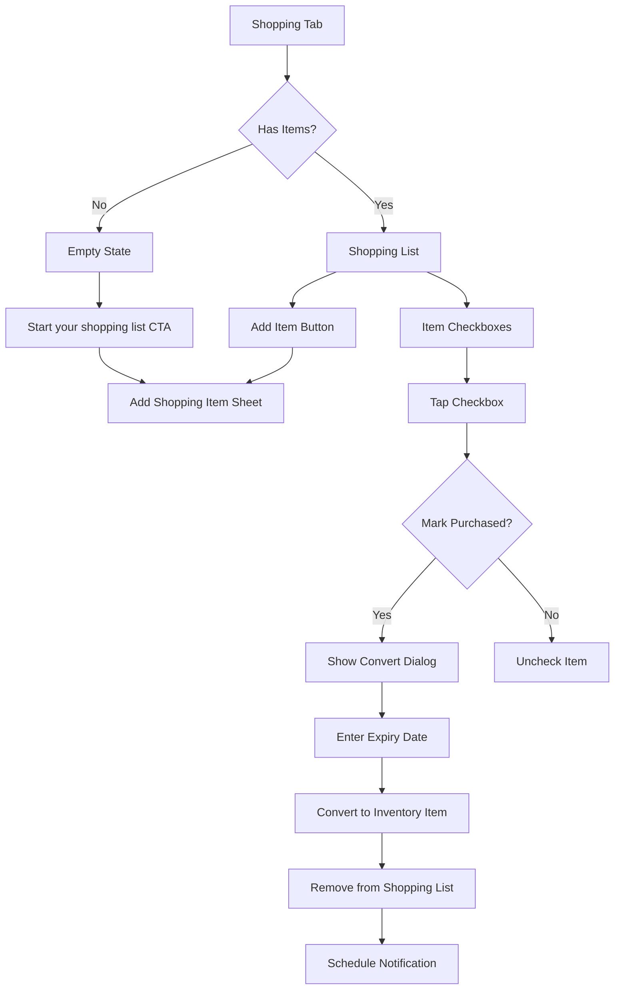

# Wireframe: Shopping List Screen

## Purpose
Simple "Next Shop" list for planning grocery purchases. Purchased items convert to inventory with automatic expiry date prompts.

## Mermaid Diagram



## Screen Layout (Mobile Portrait)

```
┌─────────────────────────────────┐
│  Shopping List                  │ ← Header
├─────────────────────────────────┤
│                                 │
│  Next Shop                      │ ← List title
│                                 │
│  ☐ Milk                    🥛  │ ← Unchecked items
│  ☐ Bread                   🍞  │
│  ☐ Apples                  🍎  │
│  ☐ Chicken breast          🍗  │
│                                 │
│  ─────────────────────────────  │ ← Divider
│                                 │
│  Purchased                      │ ← Section (collapsible)
│  ☑ Eggs                    🥚  │ ← Checked items (gray)
│  ☑ Carrots                 🥕  │
│                                 │
│  ┌─────────────────────────────┤
│  │  + Add Item                 │ │ ← Add button
│  └─────────────────────────────┘│
│                                 │
│  ┌─────────────────────────────┤
│  │  Convert Purchased (2)      │ │ ← Batch convert button
│  └─────────────────────────────┘│
│                                 │
└─────────────────────────────────┘
```

## Convert to Inventory Dialog

```
┌─────────────────────────────────┐
│  Add to Inventory       [Close] │
├─────────────────────────────────┤
│                                 │
│  🥚 Eggs                        │ ← Item being converted
│                                 │
│  This item will be added to     │
│  your inventory. When does it   │
│  expire?                        │
│                                 │
│  Expiry Date                    │
│  ┌─────────────────────────────┤ ← Date picker
│  │ Jan 22, 2026             📅││
│  └─────────────────────────────┘│
│                                 │
│  Location (optional)            │
│  ┌─────────────────────────────┤ ← Dropdown
│  │ Fridge                   ▼ ││
│  └─────────────────────────────┘│
│                                 │
│  ┌─────────────────────────────┤
│  │     Add to Inventory        │ │ ← Primary button
│  └─────────────────────────────┘│
│                                 │
│        Skip                     │
│                                 │
└─────────────────────────────────┘
```

## Empty State

```
┌─────────────────────────────────┐
│  Shopping List                  │
├─────────────────────────────────┤
│                                 │
│         🛒                      │
│                                 │
│   Your shopping list is empty   │
│                                 │
│   Add items you need to buy     │
│   on your next grocery trip     │
│                                 │
│  ┌─────────────────────────────┤
│  │  Start your shopping list   │ │ ← Primary button
│  └─────────────────────────────┘│
│                                 │
└─────────────────────────────────┘
```

## Figma Expansion Prompt

> **Prompt:** "Design a mobile shopping list screen with checkbox-style items. Show two sections: active 'Next Shop' list (unchecked items) and collapsible 'Purchased' section (checked items in gray strikethrough). Each item has emoji/icon, name, and checkbox. Add prominent '+ Add Item' button below list and 'Convert Purchased (count)' batch action button at bottom. Design a conversion dialog (bottom sheet) that prompts for expiry date when marking items purchased - include date picker, optional location dropdown, 'Add to Inventory' primary button, and 'Skip' secondary button. Use checkboxes that feel satisfying to tap (44pt touch target). Include empty state with shopping cart illustration and 'Start your shopping list' CTA. Use green primary color (#2f9e44), light gray for completed items. Follow iOS/Material Design checkbox patterns. Support swipe-to-delete on items."

## Interaction Details
- **Tab navigation:** Third tab in tab bar
- **Add item:** Opens simple bottom sheet (name + emoji picker only, no expiry yet)
- **Check item:** 
  - Single tap checkbox → Mark as purchased → Move to "Purchased" section
  - Immediately show convert dialog (or batch at end of shopping)
- **Uncheck item:** Tap checkbox again → Move back to active list
- **Swipe left:** Delete item from list (confirm dialog)
- **Convert purchased:** 
  - Batch mode: Tap button → Loop through purchased items → Prompt for expiry + location per item
  - Individual mode: Check item → Immediate convert dialog
- **Skip conversion:** Item stays in purchased list; can convert later
- **Clear purchased:** Action menu option to remove all checked items (after converting)

## Accessibility
- [ ] Checkboxes announce state: "Milk, not purchased" / "Eggs, purchased"
- [ ] Add item button clearly labeled
- [ ] Convert dialog announces item being processed: "Adding Eggs to inventory"
- [ ] Section headers use semantic headings
- [ ] Empty state CTA has clear label
- [ ] Batch convert button announces count: "Convert 2 purchased items"

## Analytics Events Logged
- `shopping_item_added` - User adds item to list
- `shopping_item_purchased` - User checks item as purchased
- `shopping_converted` - User converts purchased item to inventory (logs entry_method: "shopping_convert")

## Related Docs
- See `docs/design-tokens.md` for checkbox styling
- See issue `210-mvp-shopping-list-ui.md` and `220-mvp-convert-purchased.md` for acceptance criteria

## Status
🚧 **PLACEHOLDER** - To be expanded in Figma during M1.
