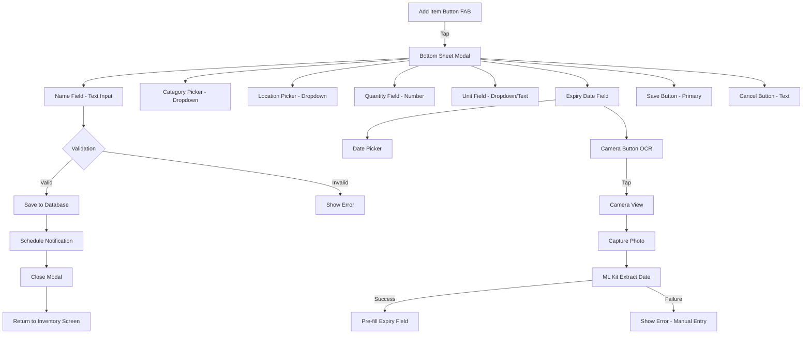

# Wireframe: Add Item Screen

## Purpose
Modal bottom sheet for quick item entry. Minimizes typing with smart defaults and category/location pickers.

## Planned M3 Expansion
- Add an optional camera-assisted panel at the top of the add-item surface for packaged-item fast add on supported mobile devices.
- The panel uses one camera view with staged guidance: barcode first, expiry date second.
- Extracted barcode details appear inline in the form before the user edits or saves.
- Once expiry is held clearly for a short stability window, the camera panel auto-locks the date and pauses or collapses to conserve resources.
- Manual fields remain editable at all times and the camera-assisted mode can be disabled from settings.

## Mermaid Diagram



## Screen Layout (Mobile Portrait)

```
┌─────────────────────────────────┐
│  Add Item               [Close] │ ← Header (24pt height)
├─────────────────────────────────┤
│                                 │
│  Name *                         │
│  ┌─────────────────────────────┤ ← Text input
│  │ Milk                        ││
│  └─────────────────────────────┘│
│                                 │
│  Category *                     │
│  ┌─────────────────────────────┤ ← Dropdown
│  │ Dairy                    ▼ ││
│  └─────────────────────────────┘│
│                                 │
│  Type *                         │ ← Segmented control
│  ┌─────────────────────────────┤
│  │  Raw   |   Prepared (Cooked)│ │
│  └─────────────────────────────┘│
│                                 │
│  Location *                     │
│  ┌─────────────────────────────┤ ← Dropdown
│  │ Fridge                   ▼ ││
│  └─────────────────────────────┘│
│                                 │
│  Prepared Date (if Prepared)    │
│  ┌─────────────────────────────┤ ← Date picker
│  │ Jan 19, 2026             📅││
│  └─────────────────────────────┘│
│                                 │
│  Quantity                       │
│  ┌──────────┬─────────────────┐ │
│  │ 1       ││ Liter        ▼ │ │ ← Number + Unit
│  └──────────┴─────────────────┘ │
│                                 │
│  Expiry Date *                  │
│  ┌────────────────────┬────────┤ ← Date picker + OCR
│  │ Jan 15, 2026    📅 │ 📷     │ ← Camera button
│  └────────────────────┴────────┘│
│                                 │
│  ┌─────────────────────────────┤
│  │     Save Item               │ ← Primary button
│  └─────────────────────────────┘│
│                                 │
│        Cancel                   │ ← Text button
│                                 │
└─────────────────────────────────┘
```

## Figma Expansion Prompt

> **Prompt:** "Create a mobile app bottom sheet modal for adding grocery items. Design a form with the following fields: item name (text input), category (dropdown with icons: vegetables 🥕, fruit 🍎, dairy 🥛, meat 🥩, etc.), location (dropdown: fridge, freezer, pantry with icons), quantity (number input) + unit (dropdown: count, kg, liters), and expiry date (date picker with camera button). The expiry date field should have two actions: a calendar icon for manual date picker AND a camera icon button for OCR scanning. Both touch targets 44pt minimum. Use a clean, minimal aesthetic with green primary color (#2f9e44) and sufficient white space. Include a prominent 'Save Item' button (green, rounded) and a subtle 'Cancel' text button. Follow iOS/Material Design guidelines for bottom sheet behavior (drag-to-dismiss handle at top). Add validation indicators (red border for empty required fields). Use SF Pro font on iOS style, Roboto on Android style. Design a camera capture overlay screen for OCR with a rectangular focus area highlighting where to aim the camera at the expiry date text on packaging."

## Interaction Details
- **Entry method:** Tap floating action button (FAB) on Inventory screen
- **Autofocus:** Name field receives focus on sheet open
- **Smart defaults:** 
  - Location: "Fridge" (most common)
  - Quantity: 1
  - Expiry: +7 days from today
- **OCR flow (optional):**
  1. Tap camera button (📷) next to expiry date field
  2. App requests camera permission if not granted (one-time)
  3. Camera view opens with rectangular focus area overlay
  4. Tap capture button or tap anywhere on screen to capture
  5. ML Kit extracts date text (supports MM/DD/YYYY, DD/MM/YYYY, "Best By", "Use By")
  6. Parsed date pre-fills expiry field (editable)
  7. If extraction fails: toast message "Couldn't read date. Please enter manually."
  8. User can always edit the OCR result or use manual date picker
- **Category icons:** Show icon + label for visual scanning
- **Date picker:** Native platform picker (iOS wheel, Android calendar)
- **Validation:** Real-time; required fields marked with * and red border if empty
- **Save behavior:** Save → schedule notification → close sheet → scroll to new item in list
- **Dismiss:** Swipe down, tap Cancel, or tap outside sheet (confirm if form dirty)

### Prepared/Cooked Items
- **Type toggle:** Raw vs Prepared (Cooked)
- **Defaults when Prepared:**
  - Location → Freezer
  - Expiry → +30 days
  - Shows "Prepared Date" field (defaults to today)
- **Visuals:** Use 🍲 icon for prepared foods; label badge "Prepared"
- **Inventory browsing:** Prepared items surface in Freezer location for quick dinner planning

## Accessibility
- [ ] All fields have accessible labels (not just placeholders)
- [ ] Tab order: Name → Category → Location → Quantity → Unit → Date → Save
- [ ] VoiceOver/TalkBack announces field requirements
- [ ] Error messages announced on save attempt
- [ ] Touch targets: 44pt × 44pt minimum
- [ ] Color contrast: 4.5:1 for text, 3:1 for UI components

## Related Docs
- See `docs/design-tokens.md` for spacing, typography, colors
- See `docs/app-flows.md` for navigation context
- See issue `140-mvp-add-item-screen.md` for acceptance criteria

## Status
🚧 **PLACEHOLDER** - To be expanded in Figma during M1.
