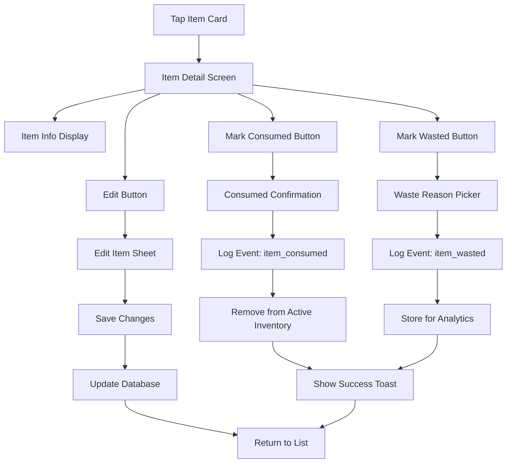

# Wireframe: Item Detail Screen

## Purpose
Full-screen view of single item with edit, consume, and discard actions. Logs outcome for analytics.

## Mermaid Diagram



## Screen Layout (Mobile Portrait)

```
┌─────────────────────────────────┐
│  ← Back                  [Edit] │ ← Header
├─────────────────────────────────┤
│                                 │
│           🥛                    │ ← Large emoji
│                                 │
│          Milk                   │ ← Item name (24pt bold)
│                                 │
│  ┌─────────────────────────────┤
│  │ Category       Dairy     🥛 │ │ ← Info rows
│  │ Type           Raw           │ │ ← Raw | Prepared
│  │ Prepared Date  —             │ │ ← If Prepared: e.g., Jan 10, 2026
│  │ Location       Fridge    ❄️ │ │
│  │ Quantity       1 Liter      │ │
│  │ Purchase Date  Jan 8, 2026  │ │
│  │ Expiry Date    Jan 15, 2026 │ │
│  │ Status         Expires in 4 │ │
│  │                days         │ │
│  └─────────────────────────────┘│
│                                 │
│  ┌─────────────────────────────┤
│  │   ✓ Mark as Consumed        │ │ ← Primary action (green)
│  └─────────────────────────────┘│
│                                 │
│  ┌─────────────────────────────┤
│  │   🗑️ Mark as Wasted         │ │ ← Secondary action (gray)
│  └─────────────────────────────┘│
│                                 │
│  Added on Jan 8, 2026 at 3:45pm │ ← Metadata (gray)
│                                 │
└─────────────────────────────────┘
```

## Waste Reason Picker (Bottom Sheet)

```
┌─────────────────────────────────┐
│  Why was it wasted?     [Close] │
├─────────────────────────────────┤
│                                 │
│  ○ Expired / spoiled            │ ← Radio buttons
│  ○ Forgotten in back of fridge  │
│  ○ Didn't like it               │
│  ○ Bought too much              │
│  ○ Cooked too much              │
│  ○ Other                        │
│                                 │
│  Percentage wasted              │ ← Slider (0–100%)
│  ┌───────────────┬────────────┐ │
│  │      65%      │  ▓▓▓▓▓▓▓▓  │ │ ← Live value + slider track
│  └───────────────┴────────────┘ │
│  (Use your best estimate)       │
│                                 │
│  Notes (optional)               │ ← Textarea
│  ┌─────────────────────────────┤
│  │ e.g., half the pot burned   │ │
│  └─────────────────────────────┘│
│                                 │
│  ┌─────────────────────────────┤
│  │     Confirm                 │ │ ← Primary button
│  └─────────────────────────────┘│
│                                 │
│        Cancel                   │
│                                 │
└─────────────────────────────────┘
```

## Success Toast

```
┌─────────────────────────────────┐
│                                 │
│  ┌─────────────────────────────┤
│  │ 🗑️ Logged: 65% wasted      │ │ ← Toast (gray bg, 3s)
│  └─────────────────────────────┘│
│                                 │
└─────────────────────────────────┘
```

## Figma Expansion Prompt

> **Prompt:** "Design a mobile app item detail screen with hero layout: large emoji/icon at top, item name in bold 24pt, and card-style info section below showing key/value pairs (Category, Location, Quantity, Purchase Date, Expiry Date, Status). Use two prominent action buttons: 'Mark as Consumed' (green, checkmark icon) and 'Mark as Wasted' (gray, trash icon). Add 'Edit' button in top-right header. For the waste reason picker, design a bottom sheet modal with radio button list (6 common reasons) and 'Confirm' button. Show success feedback as dismissible toast notification (green background, white text, checkmark icon, 3-second auto-dismiss). Use clean card layout with sufficient padding (16-24pt). Green primary (#2f9e44), neutral gray for secondary actions. Follow iOS/Material Design patterns. Touch targets 44pt minimum. Non-judgmental copy for waste logging."

## Interaction Details
- **Entry:** Tap any item card from Inventory or Expiring Soon screens
- **Edit:** Opens same Add Item sheet but pre-filled with current values
- **Mark Consumed:** 
  - Single tap → Confirm dialog ("Mark Milk as consumed?")
  - Confirm → Log event (item_consumed) → Remove from active inventory → Toast → Navigate back
- **Mark Wasted:**
  - Single tap → Open waste reason picker bottom sheet
  - Select reason → Tap Confirm → Log event (item_wasted + waste_reason) → Toast → Navigate back
- **Back button:** Return to previous screen (Inventory or Expiring Soon)
- **Deep link:** Notification taps open this screen directly

## Accessibility
- [ ] Hero emoji has alternative text (e.g., "Milk container")
- [ ] Info rows use semantic key-value pairs
- [ ] Action buttons clearly announce intent ("Mark Milk as consumed")
- [ ] Waste reason picker announces selection state
- [ ] Success toast announced by screen reader
- [ ] Confirm dialogs have clear yes/no buttons
- [ ] Color not sole status indicator (use text + icons)

## Analytics Events Logged
- `item_detail_viewed` - User opens detail screen
- `item_edited` - User saves changes via Edit
- `item_consumed` - User marks item as consumed (no waste)
- `item_wasted` - User marks item as wasted (properties: `waste_reason`, `waste_percent`, `notes`)

## Related Docs
- See `docs/design-tokens.md` for button styling
- See `docs/telemetry.md` for event properties
- See issue `170-mvp-item-detail-screen.md` for acceptance criteria

## Status
🚧 **PLACEHOLDER** - To be expanded in Figma during M1.
